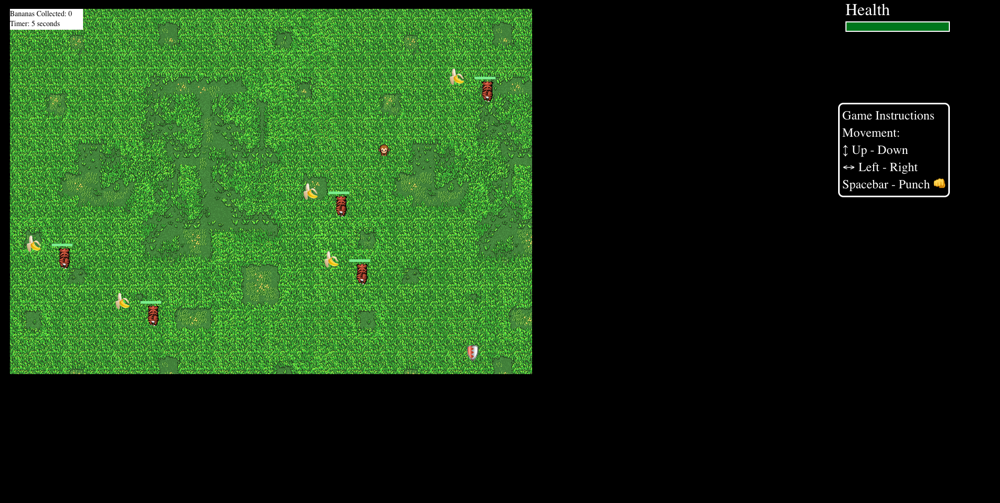

### Jungle Game.

```
This is a game that I built in pure React as a challenge and for fun. A player can move around with arrow keys to collect bananas that are being guarded by a tiger. The player can damage the tigers by punching (spacebar). The point is the collect all the bananas as fast you can!

Features:
-Collision Detection.
-Shield
- Movement
- Player Sprite.
```

```
Improvements:
- Some of the tigers move out of the game box.
- Collision detection could be improved.
```

### Getting Started

```
These instructions will get you a copy of the project up and running on your local machine for development and testing purposes.
Go to the client directory. Run npm install/yarn install followed by npm start/yarn start. Accept to listen to FE on port 3000
```

## Link to demo.

```
https://jungle-game-aaae7.firebaseapp.com/
```

### Flow for user.

`SignUp/Login`


## Game

`Game Page.`


### Prerequisites

```
npm/yarn
```

### Built With

```
React - FrontEnd
```

### Authors

```
Manider Dheer.
```

### License

```
This project is licensed under the MIT License - see the LICENSE.md file for details
```
